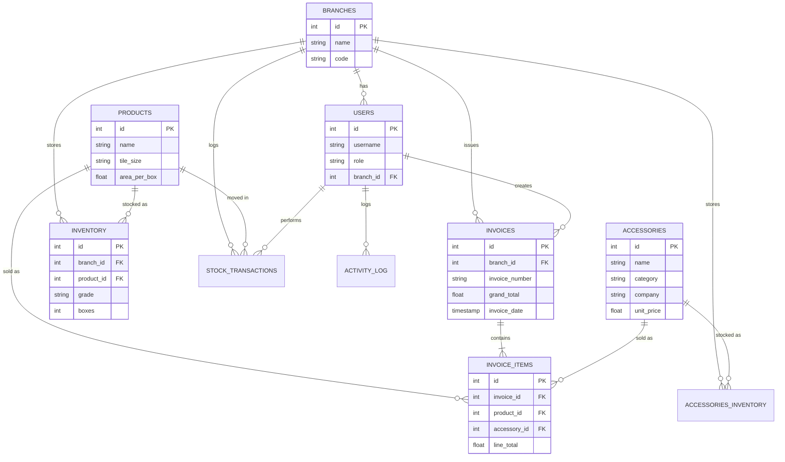

# Tile Index Database Access Guide

This guide explains how to access the database and provides a visualization of its structure (ER Diagram).

## 1. Database Location
The database file for the **Tile Index** project is located at:
`e:\Projects\Tile Index\Tile Index\data\tile_index.db`

---

## 2. Using DB Browser for SQLite
Since you have **DB Browser for SQLite** installed, follow these steps to view the data and structure:

1.  **Open DB Browser for SQLite**.
2.  Click **Open Database** (or go to `File` > `Open Database`).
3.  Navigate to the path: `e:\Projects\Tile Index\Tile Index\data\`.
4.  Select `tile_index.db` and click **Open**.
5.  **Database Structure Tab**: Here you can see all tables (Branches, Products, Invoices, etc.) and their column definitions.
6.  **Browse Data Tab**: Select a table from the dropdown to see the actual records (e.g., look at `PRODUCTS` to see your tile inventory).
7.  **Execute SQL Tab**: You can run custom queries here (e.g., `SELECT * FROM INVOICES WHERE grand_total > 5000`).

---

## 3. Database ER Diagram
Here is the Entity-Relationship (ER) diagram showing how the tables are connected.



---

## 4. Quick Access via Python
If you want to quickly see the structure without opening DB Browser, you can run the following command in your terminal:

```powershell
python check_db_structure.py
```

This script will output a text-based version of the table schemas directly to your console.
